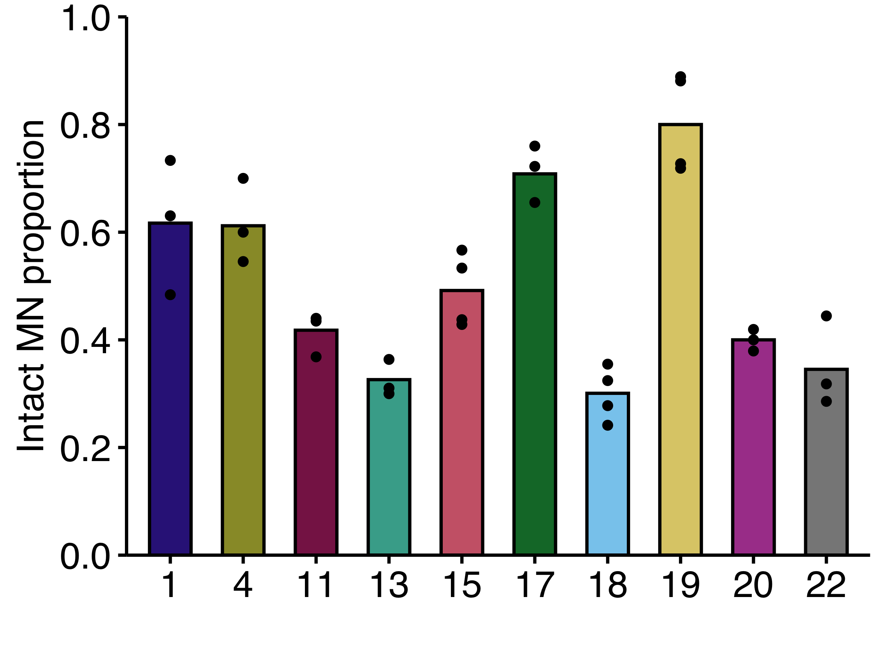

----

Micronuclei form around chromosome or chromosome fragments that missegergate during cell division. Micronuclei membranes' are unstable and frequently rupture causing DNA damage, innate immune signaling, and metastatic activation. In our recent [pre-print](https://www.biorxiv.org/content/10.1101/2021.05.12.443914v1) up on BioRxiv 'Chromosome length and gene density contribute to micronuclear membrane stability' we demonstrate that micronucleated chromosome length and gene density have additive effect on membrane stability. 

----

The graphs were generated using [ggplot2](https://ggplot2.tidyverse.org/) and the data was analyzed using [dplyr](https://dplyr.tidyverse.org/), both are part of tidyverse. Both packages can be installed with:

```
install.packages("tidyverse")
```

Additional packages used for graphics or statistics are noted in the figure tabs

<br>

**To recreate our graphs or reanalyze the data**
 
 1. Download the data sets of interest from the Hatch Lab github repository [Mammel_et_al_2021](https://github.com/hatch-lab/Mammel_etal_2021) under the "data" folder
 2. Follow the instructions and code in the figure tabs in R or RStudio
 3. R is open source so feel free to use or modify anything to fit your own data!

----

**Figure graphs**

Figure 1:

{width=45%}
